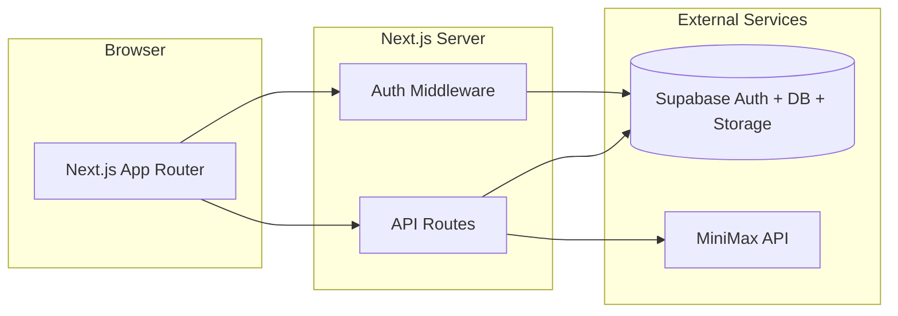

# Studimate

Studimate is an AI-powered study companion for students. You create subjects, upload PDF materials, and the app generates adaptive study plans, quizzes, and a tutor that can answer questions in text or voice—all tied to your own data in Supabase.

## What it does

| Area | Description |
|------|-------------|
| **Dashboard** | Overview of subjects, today’s plan, study streak, and quick links to planner, quiz, and tutor. |
| **Subjects** | One “study room” per subject (unique name per user): exam date, confidence, daily study hours. |
| **Upload** | PDF study materials stored in Supabase Storage; text is extracted for AI context. |
| **Planner** | MiniMax generates a **7-day rolling schedule** (today + 6 days) from subjects, materials, missed tasks, completed work, and quiz performance. |
| **Quiz** | AI-generated multiple-choice quizzes from uploaded materials; scores feed back into the planner. |
| **Tutor** | Chat grounded in selected materials; optional voice mode and read-aloud (MiniMax TTS). |
| **Streaks** | Tracks consecutive study days when you complete planner tasks. |

## Architecture



- **Frontend:** Next.js 16 (App Router), React 19, Tailwind CSS, Radix UI.
- **Backend:** Next.js API routes and server components; no separate API server.
- **Data:** Supabase (PostgreSQL, Auth, Storage).
- **AI:** [MiniMax](https://platform.minimax.io) for planner, tutor, quiz, and optional TTS.

Hosting (e.g. Vercel) only serves the Next.js app. **Supabase and MiniMax run in the cloud** even when you develop locally—you use the same project keys from `.env.local`.

## Project structure

```
app/
  (auth)/          Login & signup
  dashboard/       Home after login
  planner/         Weekly schedule grid
  quiz/            Material-based quizzes
  tutor/           Chat + voice tutor
  upload/          PDF uploads
  settings/        Profile & account
  api/             REST-style API routes
components/        UI and feature components
lib/               Supabase clients, MiniMax, planner logic, PDF parsing
hooks/             Client hooks (profile, toast, etc.)
types/             Shared TypeScript types
supabase/          SQL migrations
scripts/           Dev helpers (e.g. port check)
```

## Prerequisites

- **Node.js** 20.16+
- **npm** or **pnpm**
- A **Supabase** project (free tier is fine for development)
- A **MiniMax** API key (or enable mock mode—see below)

## Local development

### 1. Clone and install

```bash
git clone https://github.com/senanayakenithikas-ux/studimate.git
cd studimate
npm install
```

### 2. Environment variables

Copy the example file and fill in your values:

```bash
cp .env.example .env.local
```

| Variable | Required | Purpose |
|----------|----------|---------|
| `NEXT_PUBLIC_SUPABASE_URL` | Yes | Supabase project URL |
| `NEXT_PUBLIC_SUPABASE_ANON_KEY` | Yes | Public anon key (browser + server) |
| `SUPABASE_SERVICE_ROLE_KEY` | Yes | Server-only operations (planner, signup admin) |
| `MINIMAX_API_KEY` | Yes* | AI planner, tutor, quiz |
| `MINIMAX_GROUP_ID` | Yes* | MiniMax group ID |
| `MINIMAX_MODEL` | No | Default: `MiniMax-M2.7` |
| `MINIMAX_USE_MOCK=true` | No | Demo mode without MiniMax credits |

\* Not required if `MINIMAX_USE_MOCK=true`.

Get Supabase values from **Project Settings → API**. Get MiniMax values from the [MiniMax platform](https://platform.minimax.io).

### 3. Supabase auth for localhost

In the Supabase dashboard → **Authentication → URL configuration**:

- **Site URL:** `http://localhost:3000`
- **Redirect URLs:** `http://localhost:3000/**`

Without this, login and signup redirects may fail locally.

### 4. Run the dev server

```bash
npm run dev
```

Open [http://localhost:3000](http://localhost:3000).

**Port 3000 already in use?** Another dev server is probably still running. The `predev` script prints the blocking PID and suggests:

```bash
taskkill /PID <pid> /F
```

Or use the existing server at `http://localhost:3000` instead of starting a second one.

### Production build (local)

```bash
npm run build
npm start
```

## Main user flow

1. **Sign up** with a unique username and password (min 6 characters). Usernames map to internal emails for Supabase Auth.
2. **Onboarding / dashboard** — add subjects with exam date, confidence (1–5), and daily study hours.
3. **Upload** PDFs per subject.
4. **Generate plan** on the Planner page — AI creates schedule rows in `schedules` for the next 7 days.
5. **Study** — mark sessions complete on the planner grid; streak updates on the dashboard.
6. **Quiz** — take quizzes from materials; weak scores influence the next plan regeneration.
7. **Tutor** — ask questions with material context; voice routes use speech APIs when configured.

**Update plan** on the planner re-runs AI while preserving completed tasks and carrying over missed work.

## API overview

| Route | Methods | Role |
|-------|---------|------|
| `/api/auth/signup`, `/api/auth/login` | POST | Account creation and login |
| `/api/auth/logout` | POST | Sign out |
| `/api/users/sync` | POST | Sync profile after auth |
| `/api/subjects` | GET, POST | List / create subjects |
| `/api/subjects/[id]` | PATCH, DELETE | Update / delete subject |
| `/api/materials` | GET | List materials (by subject or all) |
| `/api/materials/upload` | POST | Upload PDF |
| `/api/ai/planner` | GET, POST | Load or generate 7-day schedule |
| `/api/ai/quiz` | GET, POST | List / generate / submit quizzes |
| `/api/ai/tutor` | POST | Tutor chat |
| `/api/ai/tutor/voice`, `.../speech` | POST | Voice tutor & TTS |
| `/api/sessions` | GET, PATCH | Schedule tasks (today / completion) |
| `/api/streaks` | GET | Streak stats |
| `/api/profile` | GET, PATCH | User profile |
| `/api/users/account` | DELETE | Delete account |

Protected routes expect a Supabase session (cookies) or `Authorization: Bearer <access_token>` where implemented.

## Database (Supabase)

Core tables used by the app:

| Table | Purpose |
|-------|---------|
| `users` | Profile username linked to `auth.users` |
| `subjects` | Per-user subjects and exam metadata |
| `study_materials` | PDF metadata, storage path, extracted text |
| `schedules` | Planner sessions (date, topic, duration, completed) |
| `quizzes` | Generated questions and scores |
| `chat_sessions` | Tutor conversation history |
| `streaks` | Current / longest streak per user |

Migrations live in `supabase/migrations/`. Apply them in the Supabase SQL editor or via the CLI if you use it.

## Planner behavior

- Plans cover a **rolling 7-day window** starting **today** (not calendar Mon–Sun only).
- Regeneration considers incomplete tasks, completed tasks in range, uploaded material excerpts, and quiz audits.
- The planner UI can browse adjacent 7-day blocks; generation defaults to “today + 6 days.”

## Scripts

| Command | Description |
|---------|-------------|
| `npm run dev` | Dev server on port 3000 (checks port first) |
| `npm run dev:turbo` | Dev with Turbopack |
| `npm run build` | Production build |
| `npm start` | Run production server |
| `npm run lint` | ESLint |

## Deployment notes

- Set the same environment variables on your host (Vercel, etc.).
- Add your production URL to Supabase **Redirect URLs**.
- MiniMax billing is separate from hosting; use `MINIMAX_USE_MOCK=true` only for demos, not production.

## License

Private project — see repository owner for usage terms.
